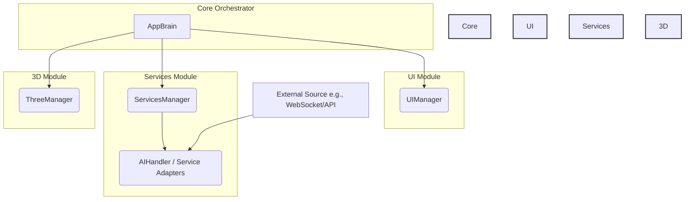

# System Patterns: AppBrain Architecture Template

**Core Pattern:** Centralized Orchestrator (`AppBrain`) with Module Separation. This pattern is ideal for applications needing to coordinate between a 3D scene (Three.js), a user interface (DOM), and external data sources/services.

**Architecture Diagram:**

**Communication Flow Example (Service -> UI/3D):**

1.  **External Input:** An external source (e.g., WebSocket message, API response) sends data to a specific handler/adapter within the Services Module (like `AIHandler`).
2.  **Service Event Emission:** The handler processes the input and emits a specific, semantic event (e.g., `changeColor`, `userData`) using its `EventEmitter` capabilities.
3.  **Service Aggregation:** `ServicesManager` listens for events from its handlers. It may perform formatting or logic before emitting a standardized `servicesChange` event to `AppBrain`, including the original event type and parameters (e.g., `this.emit('servicesChange', 'changeColor', { color: 0xff0000 })`).
4.  **Brain Orchestration:** `AppBrain` listens for `servicesChange` events. Based on the event `type`, it decides which other managers need to react and calls their public methods directly.
5.  **Module Action:** `UIManager` and/or `ThreeManager` receive method calls from `AppBrain` (e.g., `ui.changeInfoText(...)`, `three.changeColor(...)`) and update their respective domains (DOM or Three.js scene).

**Communication Flow Example (UI -> 3D):**

1.  **UI Interaction:** A user interacts with a UI element (e.g., clicks a button managed by `ToggleButton`).
2.  **UI Event Emission:** The UI component (`ToggleButton`) emits a simple event (e.g., `clicked`).
3.  **UI Manager Action:** `UIManager` listens for events from its components. It translates the low-level event into a meaningful action and emits a `uiAction` event to `AppBrain` (e.g., `this.emit('uiAction', 'toggleCube')`).
4.  **Brain Orchestration:** `AppBrain` listens for `uiAction` events. Based on the `type`, it calls the appropriate method on another manager (e.g., `three.toggleCubeVisibility()`).
5.  **Module Action:** `ThreeManager` receives the method call and updates the 3D scene accordingly.

**Key Principles for Template Usage:**

- **Decoupling:** Maintain separation. Modules (`ui`, `services`, `three`) should remain unaware of each other's internal implementation.
- **Centralization:** Use `AppBrain` as the single point of coordination for inter-module communication.
- **Explicit Communication:** Events flow _into_ `AppBrain` (via `ServicesManager`, `UIManager`, `ThreeManager`), method calls flow _out_ from `AppBrain`.
- **Semantic Events:** Design events emitted by handlers (`AIHandler`, `UIManager`, `ThreeManager`) to represent meaningful application-level actions or state changes.
- **Standardized Interfaces:** `ServicesManager` provides a consistent `servicesChange` event structure. `UIManager` provides `uiAction`. `ThreeManager` provides `objectSelected`. `AppBrain` provides clear public methods on the managers it calls.
